# weblog-vue3

个人博客的前端，使用 **Vue3+ElementPlus+Pinia+TailwindCSS+VueRouter** 搭建

# 页面展示
## 前台
- 主页
  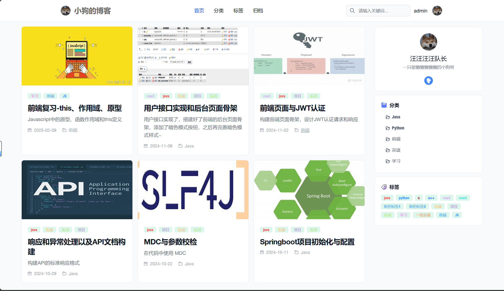
- 分类
  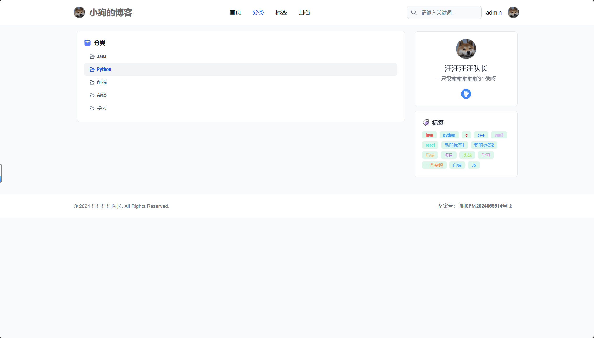
- 标签
  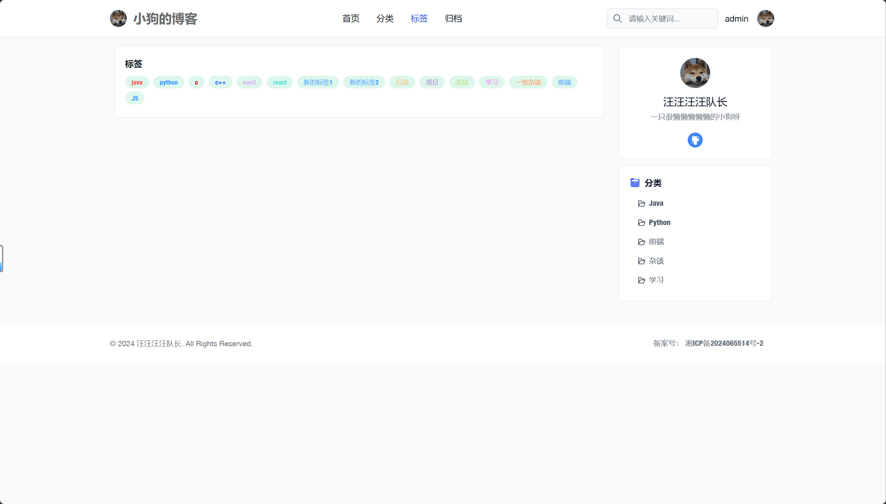
- 归档
  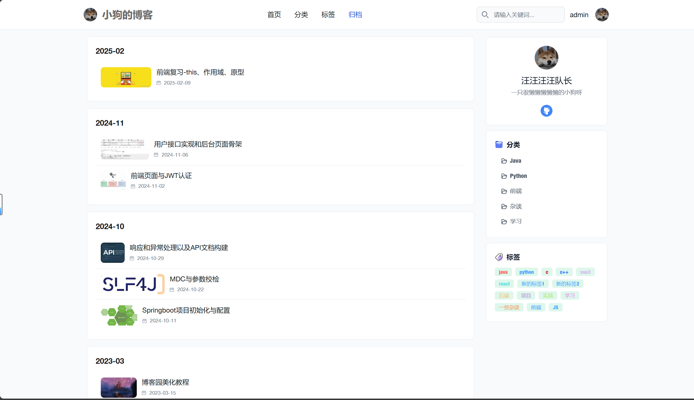
- 文章详细
  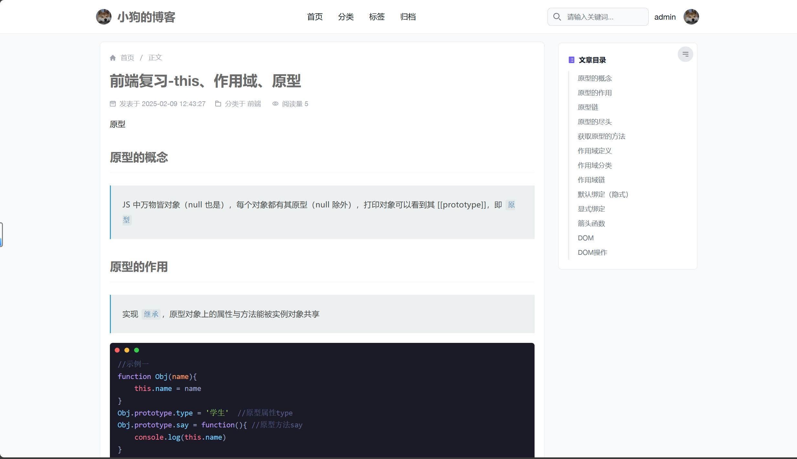
## 后台
- 后台主页
  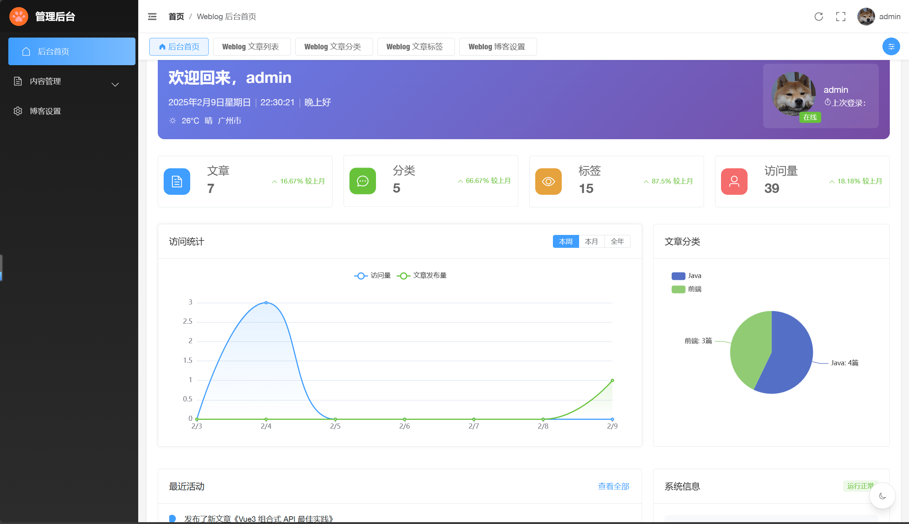
- 文章编辑器
  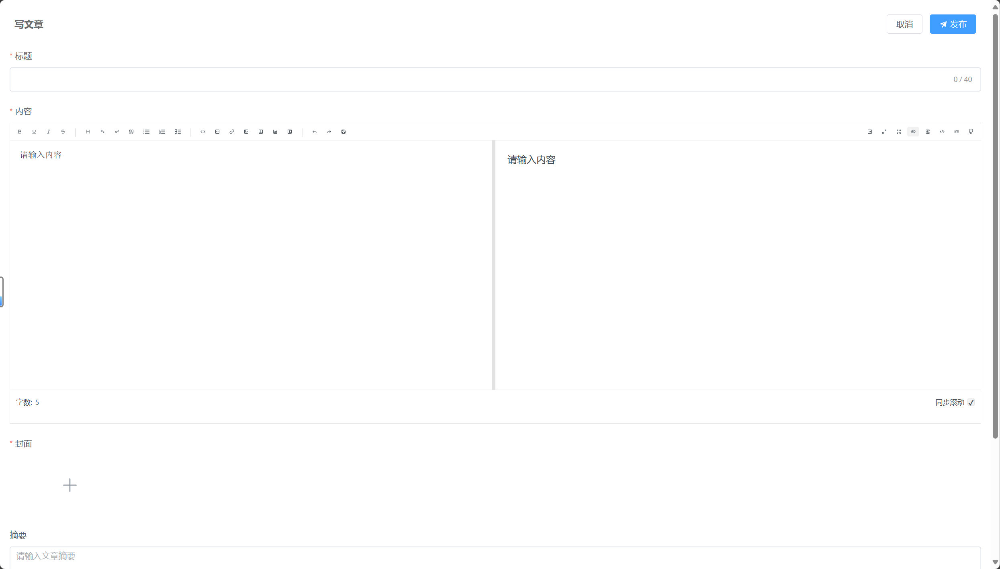
- 文章列表
  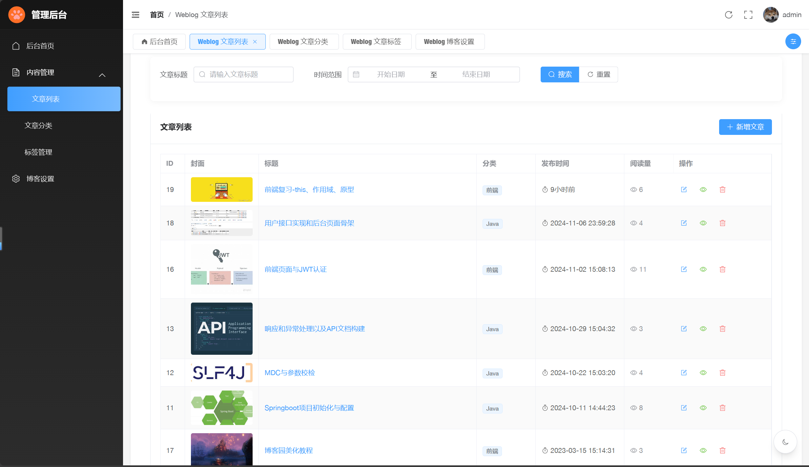
- 文章分类
  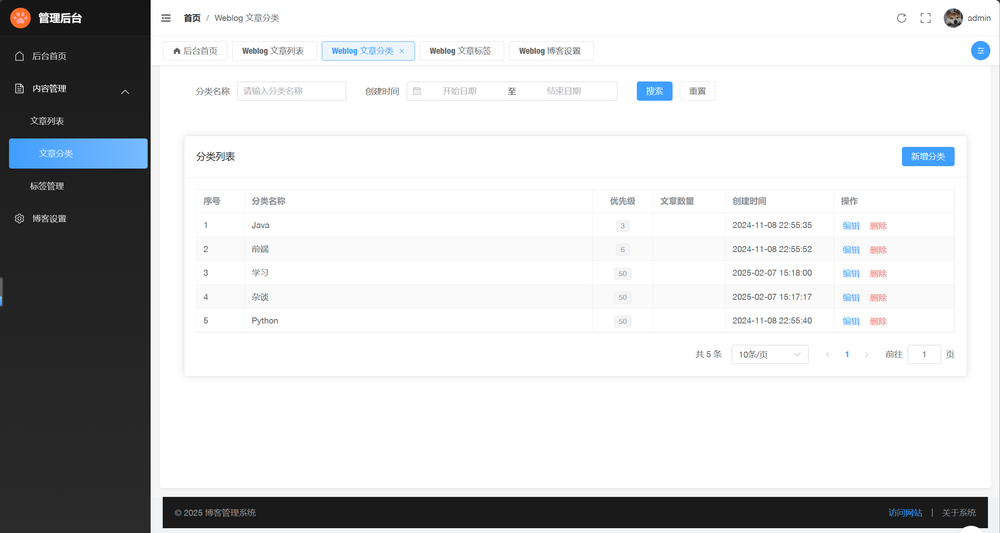
- 标签管理
  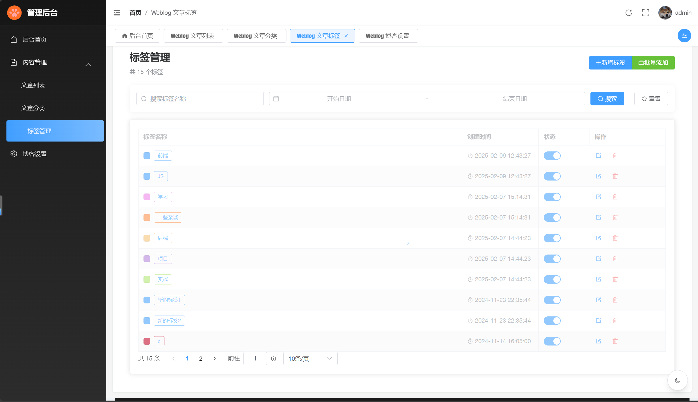
- 博客设置
  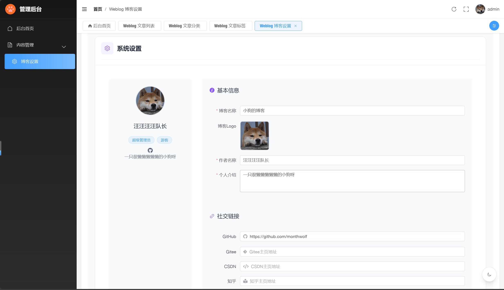
- （没完成的）暗色模式
  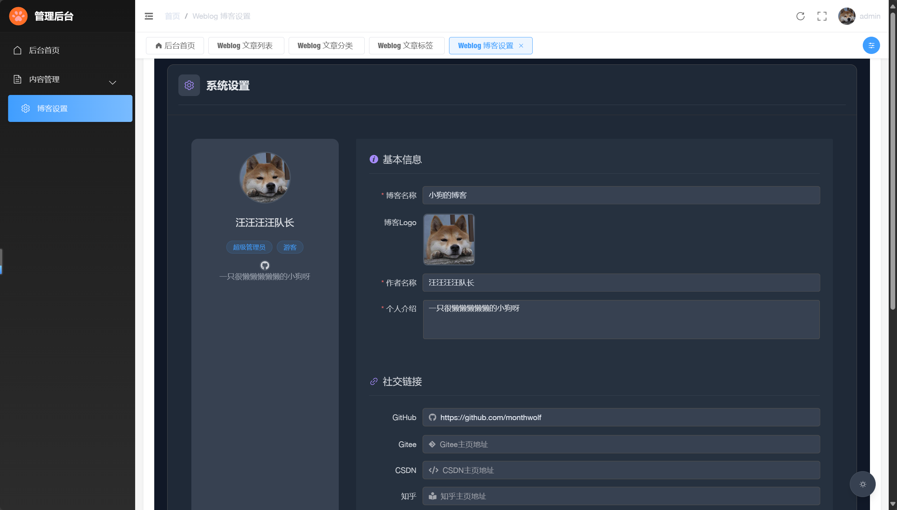
  
